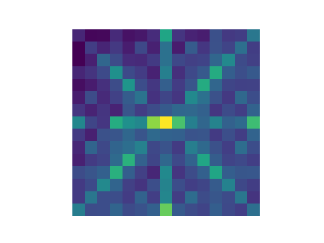

# Scrabble Stats

A quick analysis of tile placement popularity, from a collection of around 7k computer v computer [Quackle](http://people.csail.mit.edu/jasonkb/quackle/) games.



For some reason, either as a consequence inherent to the game or the algorithm's training the top right corner of the board is less popular.

```
| Quadrant | Percent of tiles |
|----------|------------------|
| NW | 17.69 |
| NE | 21.86 |
| SW | 21.4 |
| SE | 21.89 |
```

(The remaining ~20 percent comes from the central cross, which was not included in the quadrants.)